# Tests

## Operating System

| Linux Types| Version |
|:----------:|:-------:|
| RedHat     | 8       |
| RedHat     | 7       |
| CentOS     | 8       |
| CentOS     | 7       |
| Rocky      | 8       |
| SUSE       | 15      |


## Operating System

| Linux Types| Version |
|:-----------|:--------|
| RedHat     | 8       |
| RedHat     | 7       |


## Operating System

| Linux Types| Version |
|-----------:|--------:|
| RedHat     | 8       |
| RedHat     | 7       |


<details><summary>Running Playbook Result RHEL 8</summary>
<p>

#### RHEL 8

    ```This
      is the result for RHEL 8
    ```

</p>
</details>

<details><summary>Running Playbook Result RHEL 7</summary>
<p>

#### RHEL 7

    ```This
      is the result for RHEL 7
    ```

</p>
</details>


### https://mermaid-js.github.io/mermaid/#/README


DevOps Cycle:


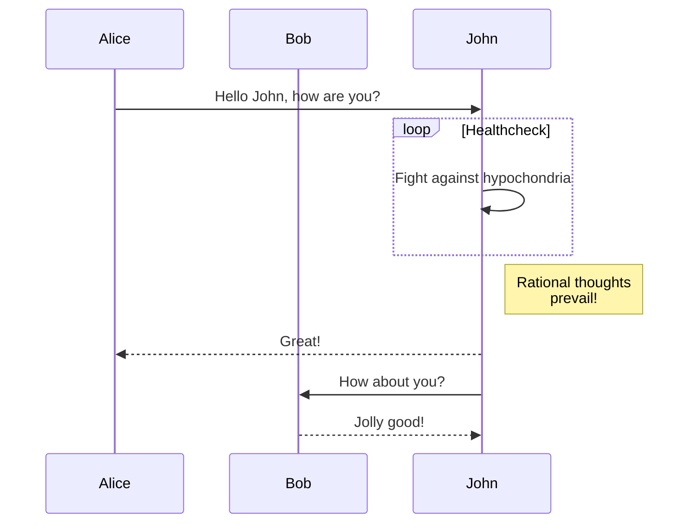


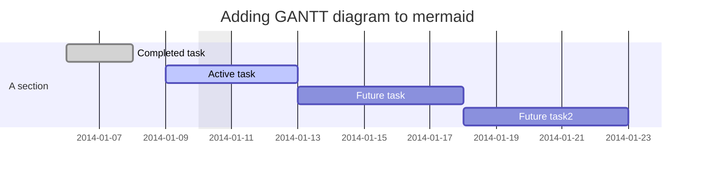


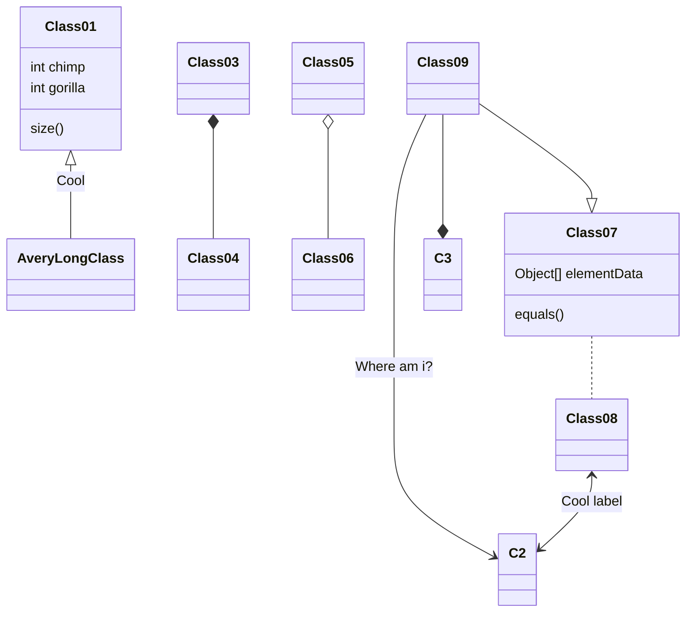


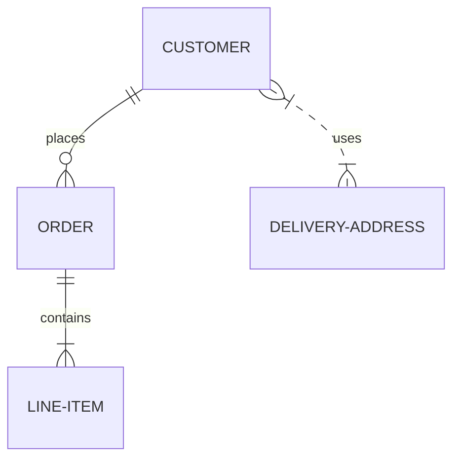

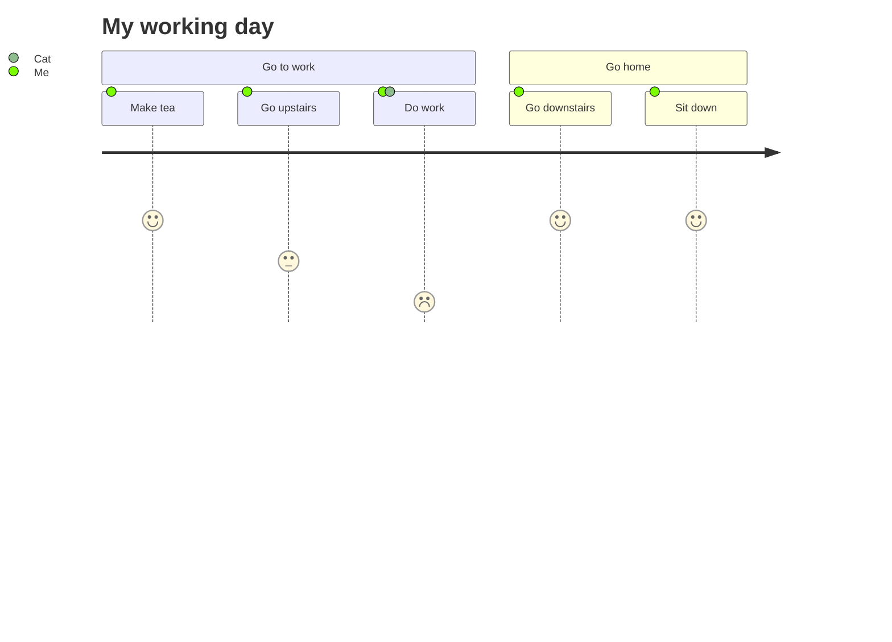


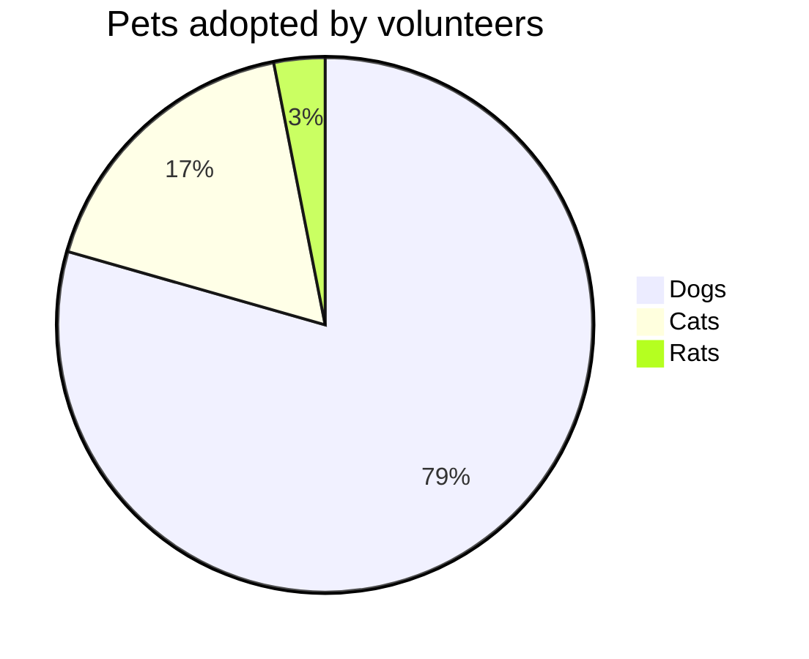


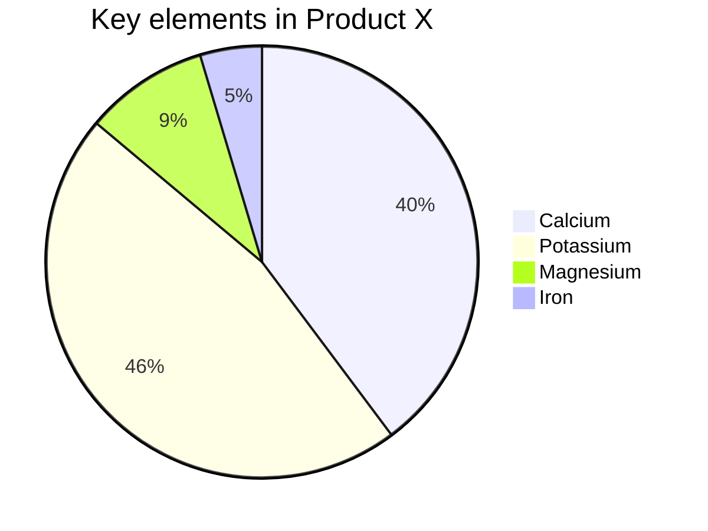


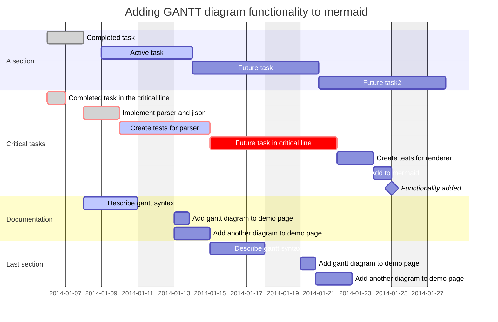


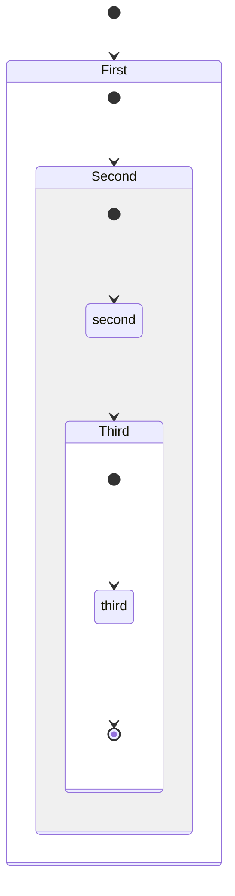


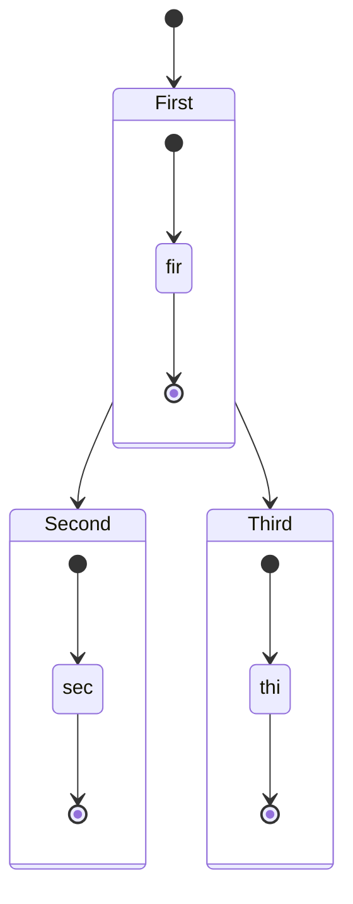


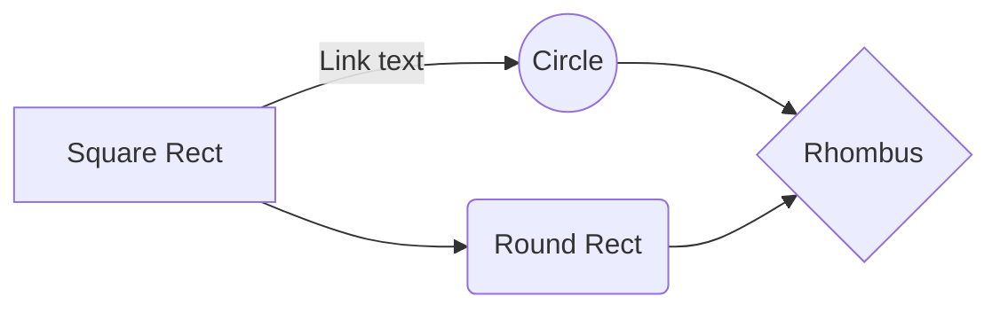


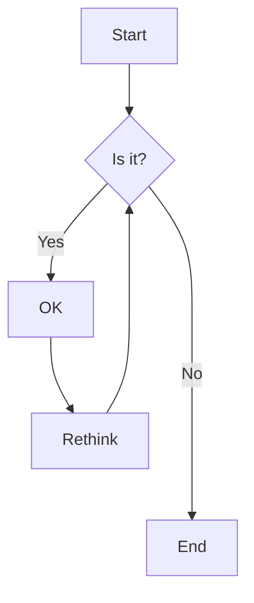


```mermaid

```
