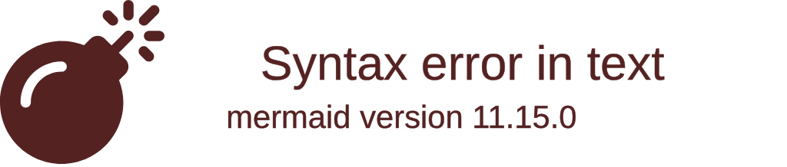

# Tests

### hey there 
<a href="https://www.instagram.com/Jimmyu/">
  
</a>
<a href="https://discord.gg/jimmy">
  
</a>
<a href="https://twitter.com/jimmyu">
  
</a>
<a href="https://www.linkedin.com/in/jimmyu/">
  
</a>

<br />
<p>&nbsp;</p>

Hi, i'm [Jimmy Ulloa](https://jimmyulloa.me/), a passionate self-taught full stack web developer and a freelance software engineer from india. my passion for software lies with dreaming up ideas and making them come true with elegant interfaces. i take great care in the experience, architecture, and code quality of the things I build.

i am also an open-source enthusiast and maintainer. i learned a lot from the open-source community and i love how collaboration and knowledge sharing happened through open-source.

  
- 💼 any freelance work? do reach, [email](mailto:jim@gmail.com) :)
- 💬 ask me about anything, i am happy to help;

**languages and tools:**  

<code></code>
<code></code>
<code></code>
<code></code>
<code></code>
<code></code>
<code></code>
<code></code>
<code></code>
<code></code>


### Hello all! 

<p>Welcome to my page! </br> I'm Jimmy Ulloa Fullstack developer from  <b>San José, Costa Rica</b> </p>

<h3>Things I code with</h3>
<p>
  
   
  
  
  
  
  
  
  
  
  
  
  
  
  
  
  
  
  
  
  
  
  
  
  
</p>


## Operating System

| Linux Types| Version |
|:----------:|:-------:|
| RedHat     | 8       |
| RedHat     | 7       |
| CentOS     | 8       |
| CentOS     | 7       |
| Rocky      | 8       |
| SUSE       | 15      |


## Operating System

| Linux Types| Version |
|:-----------|:--------|
| RedHat     | 8       |
| RedHat     | 7       |


## Operating System

| Linux Types| Version |
|-----------:|--------:|
| RedHat     | 8       |
| RedHat     | 7       |


<details><summary>Running Playbook Result RHEL 8</summary>
<p>

#### RHEL 8

    ```This
      is the result for RHEL 8
    ```

</p>
</details>


<details><summary>Running Playbook Result RHEL 7</summary>
<p>

#### RHEL 7

    ```This
      is the result for RHEL 7
    ```

</p>
</details>


### https://mermaid-js.github.io/mermaid/#/README

### https://docs.github.com/en/get-started


DevOps Cycle:





```mermaid

```
